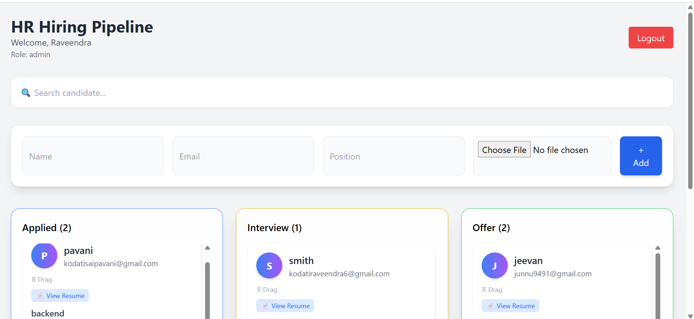
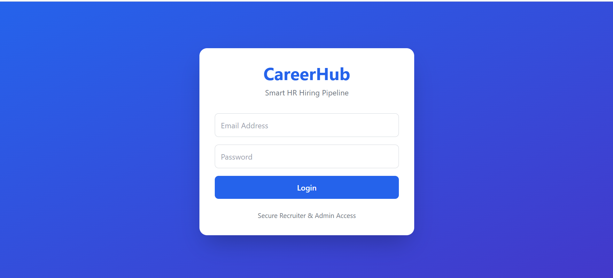
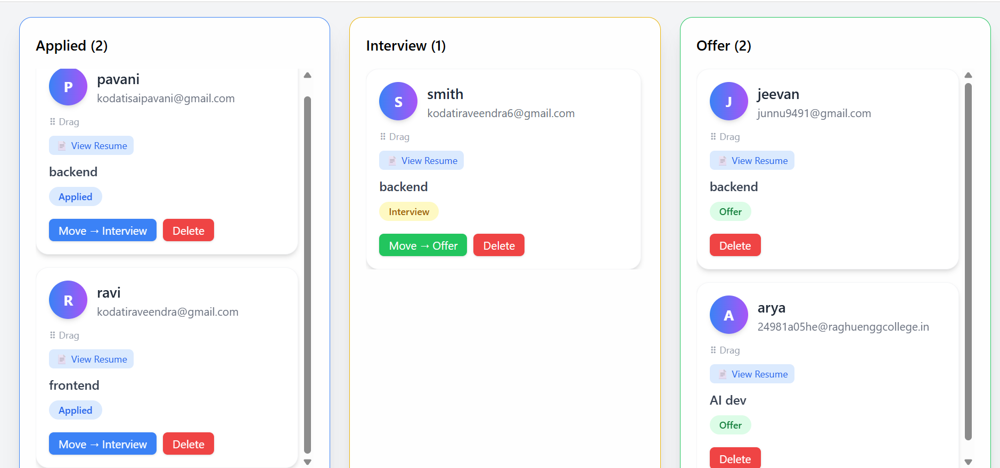

<div align="center">

# 🚀 CareerHub

### A Modern Full-Stack Job Portal for Job Seekers & Recruiters

Build • Apply • Hire

<p>


</p>

**An open-source MERN-based job portal that enables recruiters to post jobs and candidates to discover and apply for opportunities.**

⭐ Star this repository if you like the project!

</div>

---

# 📖 About

CareerHub is a modern full-stack job portal built using the MERN stack.

It provides a secure platform where recruiters can publish job opportunities while candidates can browse listings, upload resumes, and apply for jobs.

The project follows a modular architecture and is designed to be scalable, maintainable, and beginner-friendly for open-source contributors.

---

# ✨ Features

## 👨‍💼 Recruiter

- Secure Registration & Login
- JWT Authentication
- Post New Jobs
- Edit Existing Jobs
- Delete Jobs
- View Applicants
- Manage Posted Jobs

---

## 👨‍🎓 Candidate

- Register & Login
- Browse Jobs
- Search Jobs
- Apply for Jobs
- Upload Resume
- View Applied Jobs

---

## 🔒 Security

- JWT Authentication
- Protected Routes
- Role-Based Authorization
- Password Encryption
- Secure API Access

---

## 🎨 UI Features

- Fully Responsive Design
- Modern Tailwind CSS Interface
- Fast Navigation
- Mobile Friendly
- Clean User Experience

---

# 🛠 Tech Stack

## Frontend

- React
- TypeScript
- Vite
- Tailwind CSS
- React Router
- Axios

## Backend

- Node.js
- Express.js
- MongoDB
- Mongoose
- JWT Authentication
- Bcrypt
- Multer
- CORS
- dotenv

---

# 📂 Project Structure

```
CareerHub
│
├── backend
│   ├── src
│   │   ├── config
│   │   ├── controllers
│   │   ├── middleware
│   │   ├── models
│   │   ├── routes
│   │   ├── utils
│   │   └── server.ts
│   │
│   ├── uploads
│   ├── package.json
│
│
└── frontend-shell
    ├── public
    ├── src
    │   ├── components
    │   ├── pages
    │   ├── layouts
    │   ├── hooks
    │   ├── services
    │   ├── context
    │   └── assets
    │
    ├── package.json
    └── vite.config.ts
```

---


# 📋 Prerequisites

Before running the project, ensure you have:

- Node.js (v18 or above)
- npm
- MongoDB (Local or Atlas)
- Git


# 🚀 Getting Started

## Clone Repository

```bash
git clone https://github.com/Raveendra769/carrerhubv2.git
```

---

## Backend

```bash
cd backend

npm install

npm run dev
```

---

## Frontend

```bash
cd frontend-shell

npm install

npm run dev
```

---

# ⚙ Environment Variables

Create a `.env` file inside the backend directory.

```env
PORT=5000

MONGO_URI=your_mongodb_connection

JWT_SECRET=your_secret_key

CLIENT_URL=http://localhost:5173
```

---

# 📸 Screenshots

### 🏠 Home Page

<p align="center">

</p>

---

### 🔑 Login Page

<p align="center">

</p>

---

### 📊 Recruiter Dashboard

<p align="center">
  
</p>

---

## 🏗 Architecture

React + TypeScript + Tailwind CSS
│
▼
Express.js REST API
│
▼
MongoDB

---

# 🚀 Future Roadmap

- Email Verification
- Password Reset
- Company Profiles
- Saved Jobs
- Job Bookmarking
- Interview Scheduling
- Notifications
- Admin Dashboard
- Recruiter Analytics
- AI Resume Analyzer
- AI Job Recommendations
- Dark Mode
- Docker Support
- CI/CD Pipeline
- Unit Testing
- API Documentation
- Performance Optimization

---

#### 📄 .env.example

Copy `.env.example` to `.env` and update the values before running the project.

# 🌐 Live Demo

🚧 Coming Soon

# 🤝 Contributing

Contributions are always welcome!

If you'd like to contribute:

### 1. Fork the Repository

### 2. Clone your Fork

```bash
git clone https://github.com/your-username/carrerhubv2.git
```

### 3. Create a Branch

```bash
git checkout -b feature/your-feature-name
```

### 4. Make Changes

### 5. Commit

```bash
git commit -m "Added new feature"
```

### 6. Push

```bash
git push origin feature/your-feature-name
```

### 7. Open a Pull Request

---

# 🐞 Good First Issues

New contributors can start with:

- Improve UI responsiveness
- Improve Form Validation
- Add Loading Skeletons
- Improve Error Messages
- Optimize API Performance
- Improve Search Filters
- Add Pagination
- Improve Documentation
- Add Unit Tests
- Add Dark Mode
- Accessibility Improvements
- Refactor Components

---

# 📌 Open Source Guidelines

Please ensure that:

- Code follows existing project structure.
- Write meaningful commit messages.
- Test your changes before submitting.
- Keep Pull Requests focused on a single feature.
- Follow clean coding practices.

---

# 🌟 Why Contribute?

By contributing to CareerHub, you'll gain experience in:

- React
- TypeScript
- Node.js
- Express.js
- MongoDB
- REST APIs
- Authentication
- Tailwind CSS
- Git & GitHub Workflow
- Open Source Collaboration

---

## 🐛 Reporting Bugs

If you find a bug:

1. Check existing Issues.
2. Create a new Issue if it hasn't been reported.
3. Include steps to reproduce the bug.
4. Attach screenshots if applicable.


# 📄 License

This project is licensed under the **MIT License**. Feel free to use, modify, and distribute it in accordance with the license.

---

# 👨‍💻 Author

## Raveendra Kodati

Backend & Full Stack Developer
🔗 **GitHub:** https://github.com/Raveendra769

🔗 **LinkedIn:** https://linkedin.com/in/raveendra-kodati-129673359

---

<div align="center">

### ⭐ If you found this project helpful, please consider giving it a Star!

---

## 🌟 Show Your Support

If you found this project useful:

⭐ Star this repository

🍴 Fork it

🛠 Contribute

📢 Share it with others

Thank you for visiting CareerHub! 🚀

# 🙏 Acknowledgements

Thanks to all contributors who help improve CareerHub through open-source collaboration.

</div>
